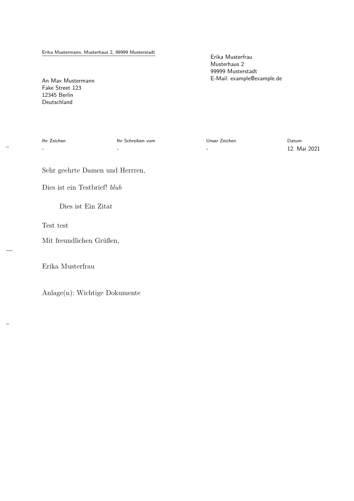

# Pandoc template for DIN5008 conforming letters


[](http://www.gnu.org/licenses/agpl-3.0)

This repository provides a simple Pandoc LaTeX template for German DIN5008A and DIN5008B conforming letters.
Internally, this template is based on the default Pandoc LaTeX template as well as the `scrletter` KOMA class.

## Example

Also see the `examples/` folder.

```markdown
---
address:
    - An Max Mustermann
    - Fake Street 123
    - 12345 Berlin
    - Deutschland
backaddress:
    - Erika Mustermann
    - Musterhaus 2
    - 99999 Musterstadt
fromaddress:
    - Musterhaus 2
    - 99999 Musterstadt
fromname: Erika Musterfrau
fromemail: example@example.de
opening: Sehr geehrte Damen und Herrren,
closing: Mit freundlichen Grüßen,
encl: Wichtige Dokumente
---

Dies ist ein Testbrief!
*blub*

> Dies ist
> Ein Zitat
 
Test test
```

> 

## Installation

Clone the repository and move the `din5008.latex` file into the Pandoc template folder.

### Windows

The template folder can be found in `%USERPROFILE%\AppData\Roaming\pandoc\templates\`.
Place the `din5008.latex` there.

### Linux

```bash
git clone https://github.com/Phoenix4815/pandoc_letter.git /tmp/din5008/
mkdir -p "$HOME/.pandoc/templates/"
cp /tmp/din5008/din5008.latex "$HOME/.pandoc/templates/"
```

### MacOS

The template folder can be found in `/Users/USERNAME/.pandoc/templates/`.
Place the `din5008.latex` there.

## Usage

Create a letter in markdown.
See the `examples/` folder for a sample letter.
Compile using

```bash
pandoc --template din5008 YOUR_LETTER.md -o YOUR_LETTER_OUTPUT.pdf
```

Most options of the default Pandoc LaTeX template should be supported.
The following additional variables may be set:

| Key                  | Description                                                                                                                                               | Default Value  |
|----------------------|-----------------------------------------------------------------------------------------------------------------------------------------------------------|----------------|
| `letteroption`       | The `scrletter` letter type                                                                                                                               | `DIN5008B`     |
| `address`            | Recipient adress                                                                                                                                          | __required__   |
| `fromaddress`        | Your address                                                                                                                                              | __required__   |
| `specialmail`        | The first three lines in the letter's window according to the [DIN standard](https://de.wikipedia.org/wiki/DIN_5008). Used to e.g. denote "Einschreiben". | _empty_        |
| `backaddress`        | Back address in the letter's window                                                                                                                       | _empty_        |
| `fromphone`          | Your phone number                                                                                                                                         | _empty_        |
| `fromfax`            | Your fax number                                                                                                                                           | _empty_        |
| `fromemail`          | Your email adress                                                                                                                                         | _empty_        |
| `yourref`            | "Ihr Zeichen"                                                                                                                                             | `-`            |
| `yourmail`           | "Ihr Schreiben vom"                                                                                                                                       | `-`            |
| `myref`              | "Unser Zeichen"                                                                                                                                           | `-`            |
| `date`               | Date of letter                                                                                                                                            | _current date_ |
| `opening`            | The letter's opening                                                                                                                                      | __required__   |
| `closing`            | The letter's closing                                                                                                                                      | __required__   |
| `ps`                 | Post scriptum                                                                                                                                             | _empty_        |
| `cc`                 | CC                                                                                                                                                        | _empty_        |
| `encl`               | List of attachments, that will be listed at the end of the letter                                                                                         | _empty_        |
| `attachments-duplex` | If `true`, insert blank pages in between the letter and all the attachments, such that every document begins on its own sheet of paper                    | `false`        |
| `attachments`        | Append files as attachments to the letter. See [the section below](#attachments)                                                                          | _empty_        |

### Attachments
Currently only PDF-files are supported.
For every attachment, the following keys are available:

| Key       | Description                                                                     | Default Value         |
|-----------|---------------------------------------------------------------------------------|-----------------------|
| `name`    | Filename/path of the file                                                       | __required__          |
| `pages`   | Range of pages to be included                                                   | `-` (i.e. every page) |
| `options` | List of further options. See [pdfpages here](https://www.ctan.org/pkg/pdfpages) | _empty_               |

Example code:

```markdown
encl: [Formular 123, Schein A38]
attachments-duplex: true
attachments:
    - name: formular123.pdf
    - name: A38.pdf
      pages: 1-2, 38
      options: [landscape=true]
```
